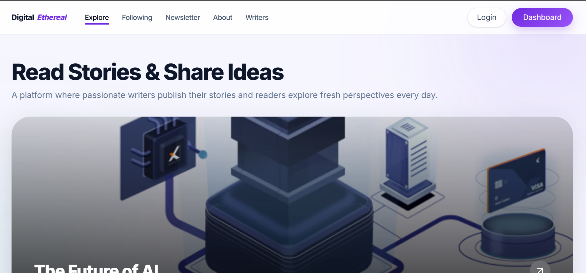
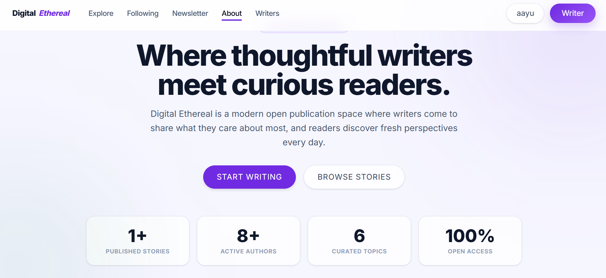
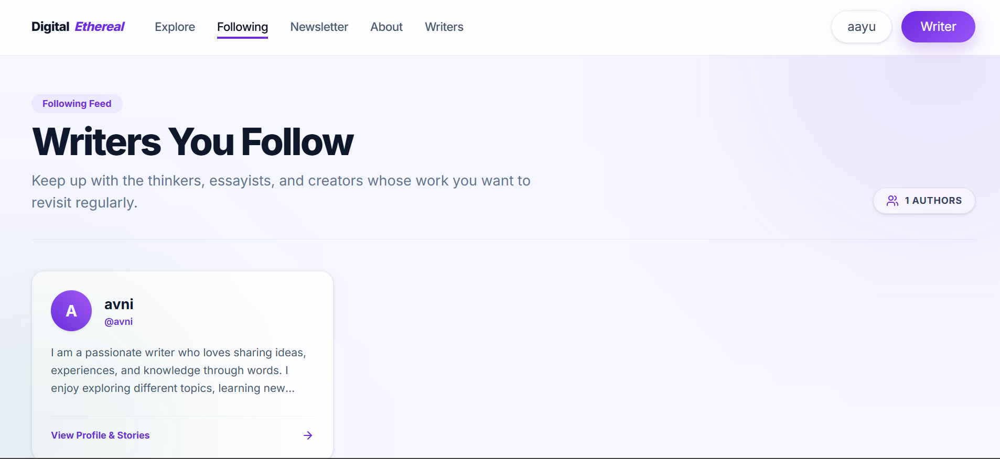
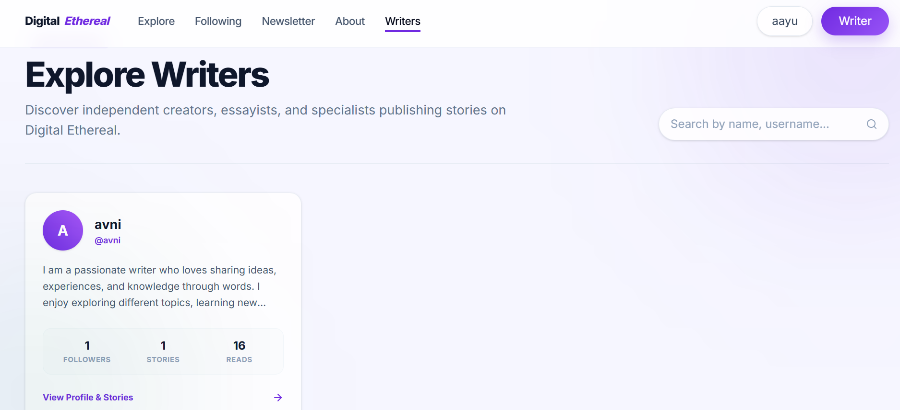
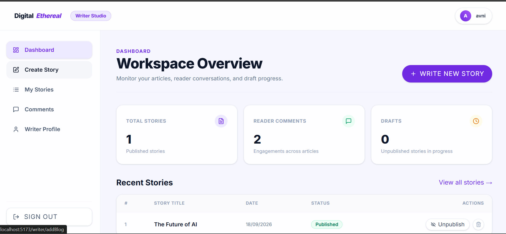
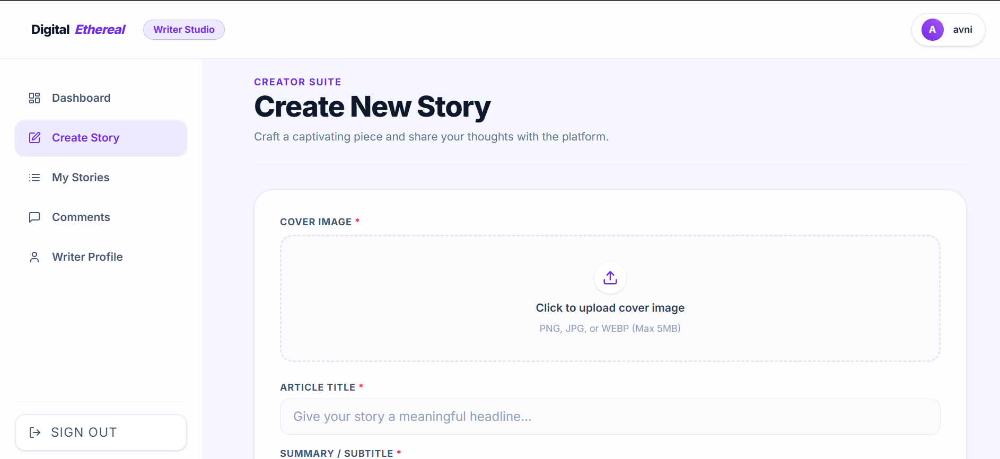
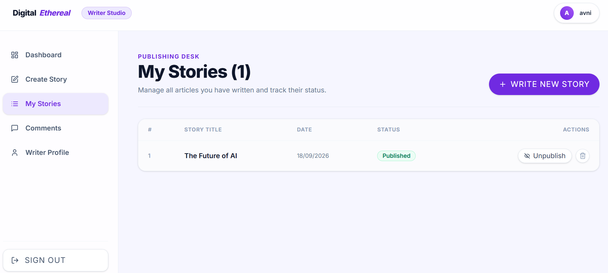
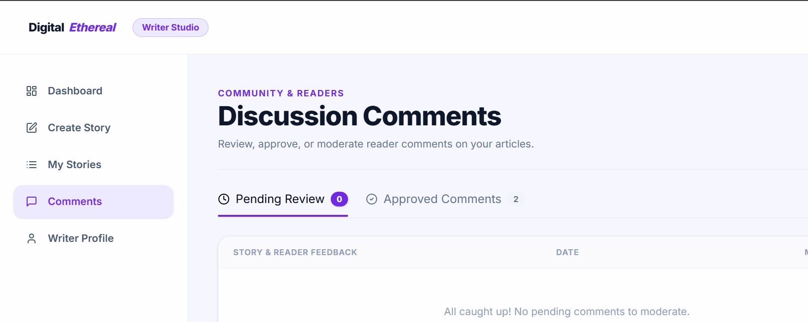
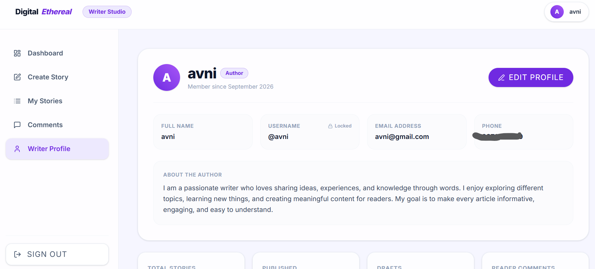

# Blog Website — MERN Stack

A full-stack blogging platform built with the **MERN stack**, featuring a public reader experience, authenticated user accounts, and a dedicated writer dashboard for creating and managing blog posts.

---

## Overview

This project is divided into two applications:

* **Frontend** — React + Vite based user interface
* **Backend** — Node.js + Express + MongoDB REST API

The application uses **ImageKit** for image uploads and delivery.

---
Live Demo

(https://blog-website-mern-85yz1i48m-aayushi21.vercel.app)

## Features

### Reader Features

* Browse published blogs
* Read blogs with rich-text content
* User registration and login
* Like and dislike blogs
* Bookmark blogs
* Share blogs
* Follow writers
* View writer profiles
* Add comments
* View approved comments
* Update profile
* Change password
* Reset password through email

### Writer Features

* Writer registration and login
* Writer dashboard
* View total blogs, published blogs and drafts
* Create new blogs
* Add:

  * Title
  * Subtitle
  * Rich-text description
  * Category
  * Thumbnail
* Save blogs as drafts
* Publish and unpublish blogs
* View personal stories
* Delete blogs
* Manage comments
* Writer profile
* Update password
* Password reset through email

---

## Screenshots

### Reader Experience










### Writer Dashboard











---

## Tech Stack

### Frontend

* React 19
* Vite
* React Router
* Tailwind CSS
* Axios
* React Hot Toast
* React Quill
* Motion
* Styled Components

### Backend

* Node.js
* Express.js
* MongoDB
* Mongoose
* JWT Authentication
* Multer
* ImageKit

---

## Project Structure

```text
Blog/
│
├── backend/
│   ├── config/
│   ├── controllers/
│   ├── middleware/
│   ├── models/
│   ├── routes/
│   ├── server.js
│   ├── package.json
│   └── ...
│
├── frontend/
│   ├── src/
│   │   ├── components/
│   │   ├── pages/
│   │   ├── assets/
│   │   └── ...
│   ├── package.json
│   └── ...
│
├── screenshots/
│   ├── login.png
│   ├── signup.png
│   ├── home.png
│   ├── about.png
│   ├── following.png
│   ├── writers.png
│   ├── writer-dashboard.png
│   ├── create-story.png
│   ├── my-stories.png
│   ├── comments.png
│   └── writer-profile.png
│
├── .gitignore
├── README.md
└── package-lock.json
```

---

## Authentication

The application has two separate authentication flows:

### User Authentication

Users can:

* Register
* Login
* Manage their profile
* Like and bookmark blogs
* Follow writers
* Comment on blogs
* Reset their password

### Writer Authentication

Writers have a dedicated dashboard where they can:

* Create blogs
* Save drafts
* Publish blogs
* Edit/manage their stories
* Manage comments
* Manage their writer profile

Authentication is handled using **JWT tokens** and protected routes.

---

## Environment Variables

### Backend

Create a `.env` file inside the `backend` folder:

```env
PORT=3000
MONGODB_URI=your_mongodb_connection_string
JWT_SECRET=your_jwt_secret
IMAGEKIT_PUBLIC_KEY=your_imagekit_public_key
IMAGEKIT_PRIVATE_KEY=your_imagekit_private_key
IMAGEKIT_URL_ENDPOINT=your_imagekit_url_endpoint
```

### Frontend

Create a `.env` file inside the `frontend` folder:

```env
VITE_BASE_URL=http://localhost:3000
```

> Never commit `.env` files or secret credentials to GitHub.

---

## API Routes

### Blog

```text
/api/blog
```

Handles:

* Blog creation
* Blog listing
* Blog details
* Publishing
* Updating
* Deleting
* Likes
* Comments

### User

```text
/api/user
```

Handles:

* User authentication
* Profile
* Password management
* Following
* Bookmarks

### Writer

```text
/api/writer
```

Handles:

* Writer registration
* Writer login
* Writer profile
* Writer blogs
* Writer dashboard
* Comment management

---

## Installation

### 1. Clone the Repository

```bash
git clone <your-github-repository-url>
cd Blog
```

### 2. Install Backend Dependencies

```bash
cd backend
npm install
```

### 3. Install Frontend Dependencies

Open another terminal:

```bash
cd frontend
npm install
```

---

## Run the Project

### Start Backend

Inside the `backend` folder:

```bash
npm run dev
```

The backend will run on:

```text
http://localhost:3000
```

### Start Frontend

Inside the `frontend` folder:

```bash
npm run dev
```

Vite will provide the local frontend URL in the terminal.

---

## Requirements

Before running the project, make sure you have:

* Node.js 18+
* MongoDB
* ImageKit account
* Git

---

## Notes

* Only published blogs are displayed to readers.
* Writers can keep blogs as drafts before publishing.
* Comments require moderation before appearing publicly.
* Blog thumbnails are uploaded and served using ImageKit.
* Blog descriptions support rich-text HTML content.
* MongoDB is used for storing users, writers, blogs and comments.

---

## Project Status

The project is currently functional and includes both the **reader experience** and **writer dashboard**.

There is currently no automated test suite included.
